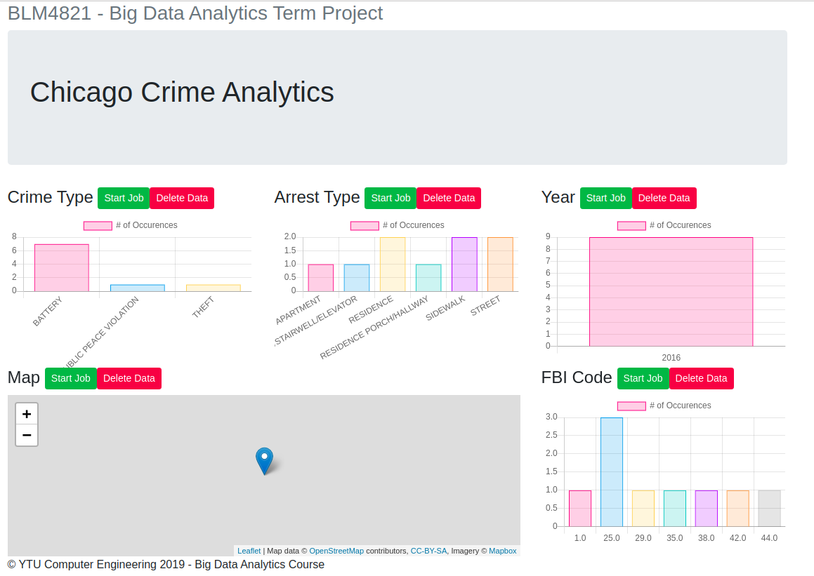

# BLM4120 Big Data Processing Term Project

This repo contains Yildiz Technical University BLM4120 Course's term project codes.
In this project a dataset processed in Hadoop Ecosystem with MapReduce programming model.
The dataset contains Crimes in Chicago and it is publicly available at https://www.kaggle.com/chicago/chicago-crime. 
5 different MapReduce jobs written in java. To visualize calculated results, a web app developed with Python/Flask and Chart.js

### Web Application

### MapReduce Jobs

- **Crime Type Count:** Count the types of crime
- **FBI Code Count:** Count the types of FBI Code
- **Average Latitude:** Calculate the average value of Latitude's
- **Average Longitude:** Calculate the average value of Latitude's
- **Most Frequent Year:** Calculate the most frequent year
